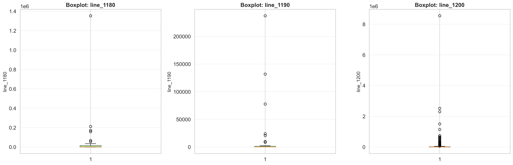

# 📊 Анализ финансовой отчётности российских компаний

Исследовательский анализ данных (EDA) датасета RFSD (Russian Financial Statements Dataset).

---

## 📁 Структура проекта

```
ex02/
│
├── data/
│   ├── raw/
│   │   └── part-0.parquet           # Исходный датасет (3,170,560 × 213) через Git LFS
│   └── processed/
│       └── rfsd_1000x20.csv         # Обработанная выборка (1,000 × 20)
│
├── notebooks/
│   └── analysis.ipynb                # Jupyter notebook с анализом
│
├── visualizations/                   # Результаты визуализации
│   ├── boxplots.png
│   ├── correlation_matrix.png
│   ├── histograms/
│   │   └── histograms_combined.png
│   └── scatter_plots/
│       └── scatter_plots_combined.png
│
├── .gitattributes                    # Конфигурация Git LFS
└── README.md
```

---

## 🛠️ Технологии

- Python 3.11+
- Pandas 2.0+ (обработка данных)
- NumPy 1.24+ (вычисления)
- Matplotlib 3.7+ (визуализация)
- Seaborn 0.12+ (статистические графики)
- SciPy 1.10+ (статистика)
- Jupyter Notebook (среда анализа)
- PyArrow 14.0+ (работа с Parquet)

---

## 📊 Датасет

**Источник:** RFSD (Russian Financial Statements Dataset)

**Исходный датасет:**
- Формат: Parquet
- Размер: 3,170,560 строк × 213 колонок
- Содержание: финансовая отчётность российских компаний

**Обработанный датасет:**
- Размер: 1,000 строк × 20 колонок
- Отобранные показатели:
  - Метаданные: ИНН, ОГРН, регион, коды классификаторов
  - Бизнес-характеристики: дата создания, возраст компании, ОКВЭД, организационно-правовая форма
  - Финансовые показатели: данные из бухгалтерского баланса (line_1180, line_1190, line_1200, line_1210)
  - Технические поля: totals_adjustment, outlier, financial

---

## 🔍 Проведенный анализ

### 1. Подготовка данных
- Загружен датасет из формата Parquet (3.17 млн строк, 213 колонок)
- Выполнена выборка 1,000 строк
- Отобрано 20 ключевых колонок для анализа
- Проведена оценка пропущенных значений

### 2. Описательная статистика
- Вычислены основные статистические показатели по всем числовым колонкам
- Проанализированы типы данных
- Оценено качество данных

### 3. Визуализация распределений
- Построены гистограммы распределений для ключевых показателей
- Сохранены в [`visualizations/histograms/histograms_combined.png`](visualizations/histograms/histograms_combined.png)

### 4. Анализ выбросов
- Построены boxplot-диаграммы для выявления аномальных значений
- Результат: [`visualizations/boxplots.png`](visualizations/boxplots.png)

### 5. Корреляционный анализ
- Вычислена матрица корреляций между числовыми переменными
- Визуализация: [`visualizations/correlation_matrix.png`](visualizations/correlation_matrix.png)

### 6. Scatter plots
- Построены диаграммы рассеивания для анализа взаимосвязей
- Результат: [`visualizations/scatter_plots/scatter_plots_combined.png`](visualizations/scatter_plots/scatter_plots_combined.png)

---

## 📈 Визуализации

### Матрица корреляции


### Гистограммы распределений


### Анализ выбросов


### Scatter plots


---

## 🚀 Запуск проекта

### 1. Клонирование репозитория

```bash
git clone <repository-url>
cd ex02
```

### 2. Установка Git LFS

Для работы с большим датасетом (part-0.parquet) требуется Git LFS:

**Windows:**
- Скачать с https://git-lfs.github.com/

**Linux:**
```bash
sudo apt-get install git-lfs
```

**Mac:**
```bash
brew install git-lfs
```

Инициализация:
```bash
git lfs install
```

### 3. Создание виртуального окружения

**Windows:**
```bash
python -m venv venv
venv\Scripts\activate
```

**Linux/Mac:**
```bash
python3 -m venv venv
source venv/bin/activate
```

### 4. Установка зависимостей

```bash
pip install pandas numpy matplotlib seaborn jupyter scipy pyarrow
```

Или через файл requirements.txt (если добавлен в проект):
```bash
pip install -r requirements.txt
```

### 5. Запуск анализа

```bash
jupyter notebook notebooks/analysis.ipynb
```

---

## 📋 Что добавлено в Git

**Данные:**
- `data/raw/part-0.parquet` (через Git LFS) - исходный датасет
- `data/processed/rfsd_1000x20.csv` - обработанная выборка

**Код:**
- `notebooks/analysis.ipynb` - Jupyter notebook с полным анализом

**Визуализации:**
- `visualizations/correlation_matrix.png` - матрица корреляций
- `visualizations/boxplots.png` - анализ выбросов
- `visualizations/histograms/histograms_combined.png` - гистограммы
- `visualizations/scatter_plots/scatter_plots_combined.png` - диаграммы рассеивания

**Конфигурация:**
- `.gitattributes` - настройка Git LFS для файлов *.parquet и *.csv
- `README.md` - документация проекта

---

## 🔧 Структура датасета

**Обработанная выборка (rfsd_1000x20.csv)** содержит следующие колонки:

| Колонка | Описание |
|---------|----------|
| `inn` | ИНН компании |
| `ogrn` | ОГРН |
| `region` | Регион |
| `region_taxcode` | Налоговый код региона |
| `creation_date` | Дата создания компании |
| `dissolution_date` | Дата ликвидации (если есть) |
| `age` | Возраст компании |
| `eligible` | Критерий приемлемости |
| `exemption_criteria` | Критерий освобождения |
| `financial` | Финансовый показатель |
| `line_1180` | Строка 1180 баланса |
| `line_1190` | Строка 1190 баланса |
| `line_1200` | Строка 1200 баланса |
| `line_1210` | Строка 1210 баланса |
| `totals_adjustment` | Корректировка итогов |
| `outlier` | Флаг выброса |
| `okved` | Код ОКВЭД |
| `okved_section` | Секция ОКВЭД |
| `okpo` | ОКПО |
| `okopf` | ОКОПФ |

---

## ⚙️ Git LFS конфигурация

Файл [`.gitattributes`](.gitattributes) настроен для отслеживания больших файлов:

```
*.parquet filter=lfs diff=lfs merge=lfs -text
*.csv filter=lfs diff=lfs merge=lfs -text
```

Это обеспечивает эффективное хранение датасетов в репозитории.

---

## 📚 Источник данных

**RFSD Dataset:** https://github.com/irlcode/RFSD

Датасет содержит финансовую отчётность российских компаний, собранную из открытых источников.

---

## 👤 Автор

**Университет:** Университет Иннополис  
**Год:** 2026

---

**Дата создания:** 11 мая 2026  
**Последнее обновление:** 14 мая 2026
