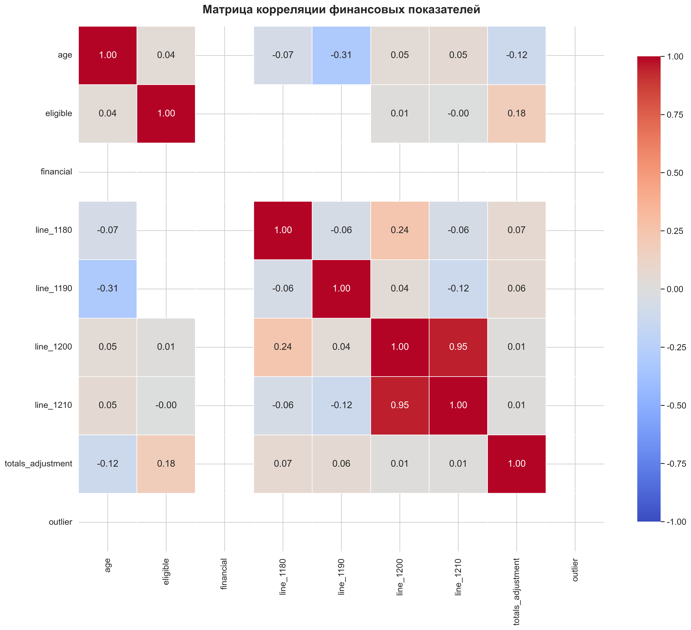
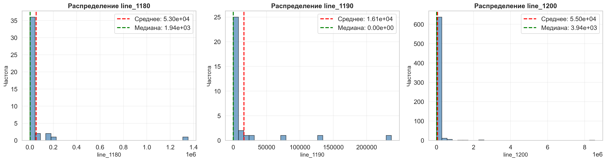
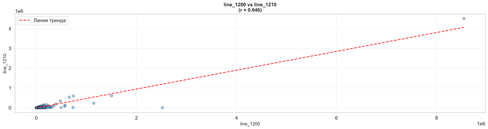

# 📊 Анализ финансовой отчётности российских компаний.

Исследовательский анализ данных (EDA) датасета RFSD (Russian Financial Statements Dataset), содержащего финансовую отчётность российских компаний.

---

## 🎯 Цель проекта

Выявление закономерностей, корреляций и аномалий в финансовых показателях российских компаний на основе анализа исторических данных финансовой отчётности.

## 📁 Структура репозитория

```
ex02/
│
├── data/
│   ├── raw/                      # Исходные данные (Git LFS)
│   │   └── rfsd_full.csv        # Полный датасет RFSD
│   └── processed/                # Обработанные данные
│       └── rfsd_1000x20.csv     # Датасет 1000 строк × 20 колонок
│
├── notebooks/
│   └── analysis.ipynb            # Jupyter notebook с полным анализом
│
├── visualizations/               # Сохранённые визуализации
│   ├── histograms/              # Гистограммы распределений
│   ├── scatter_plots/           # Диаграммы рассеивания
│   ├── correlation_matrix.png   # Матрица корреляции
│   └── boxplots.png             # Анализ выбросов
│
├── plans/
│   └── financial_analysis_plan.md  # Детальный план выполнения
│
├── .gitattributes               # Конфигурация Git LFS
├── .gitignore                   # Игнорируемые файлы
├── requirements.txt             # Зависимости проекта
└── README.md                    # Этот файл
```

---

## 🛠️ Технологии

- **Python 3.11+**
- **Pandas 2.0+** - обработка и анализ данных
- **NumPy 1.24+** - численные вычисления
- **Matplotlib 3.7+** - визуализация
- **Seaborn 0.12+** - статистическая визуализация
- **SciPy 1.10+** - статистический анализ
- **Jupyter Notebook** - интерактивный анализ

---

## 📥 Установка и запуск

### 1. Клонирование репозитория

```bash
git clone https://github.com/[your-username]/ex02.git
cd ex02
```

### 2. Создание виртуального окружения

**Windows:**
```bash
python -m venv venv
venv\Scripts\activate
```

**Linux/Mac:**
```bash
python3 -m venv venv
source venv/bin/activate
```

### 3. Установка зависимостей

```bash
pip install -r requirements.txt
```

### 4. Скачивание датасета RFSD

**Вариант 1: Из официального репозитория**
```bash
# Клонируйте репозиторий RFSD
git clone https://github.com/irlcode/RFSD.git

# Скопируйте датасет в директорию проекта
copy RFSD\data\*.csv data\raw\
```

**Вариант 2: Прямая загрузка**
- Перейдите на https://github.com/irlcode/RFSD
- Скачайте датасет вручную
- Поместите файл в `data/raw/rfsd_full.csv`

### 5. Запуск Jupyter Notebook

```bash
jupyter notebook notebooks/analysis.ipynb
```

---

## 📊 Методология

### 1. Подготовка данных

- **Исходный датасет:** RFSD - финансовая отчётность российских компаний
- **Отбор колонок:** Выбрано 20 наиболее информативных показателей:
  - Метаданные: название компании, год, отрасль
  - Финансовые показатели: активы, выручка, прибыль, капитал
  - Расчётные коэффициенты: ROE, ROA, долг/капитал, ликвидность
- **Выборка:** 1000 строк с использованием стратифицированного сэмплирования для репрезентативности

### 2. Исследовательский анализ данных (EDA)

#### 📈 Описательная статистика
- Вычисление центральных тенденций (среднее, медиана)
- Меры разброса (стандартное отклонение, квартили)
- Анализ пропущенных значений

#### 📊 Визуализация распределений
- Гистограммы для 3 ключевых показателей
- Идентификация типов распределений (нормальное, асимметричное)
- Сравнение среднего и медианы

#### 🔍 Анализ выбросов
- Метод межквартильного размаха (IQR)
- Boxplot для визуализации аномалий
- Интерпретация природы выбросов

#### 🔗 Корреляционный анализ
- Матрица корреляции Пирсона для всех числовых переменных
- Heatmap для визуализации связей
- Идентификация сильных корреляций (|r| > 0.7)

#### 📉 Scatter plots
- Диаграммы рассеивания для коррелирующих пар
- Линии тренда
- Цветовое кодирование по категориям (отрасли)

---

## 🔍 Основные результаты

### Интересная деталь №1: [Название]

**Описание:**  
[Здесь будет описание первой находки на основе проведённого анализа]

**Иллюстрация:**  


**Значимость:**  
[Что это значит для понимания финансового состояния компаний]

---

### Интересная деталь №2: [Название]

**Описание:**  
[Описание второй находки]

**Иллюстрация:**  


**Значимость:**  
[Практические выводы]

---

### Интересная деталь №3: [Название]

**Описание:**  
[Описание третьей находки]

**Иллюстрация:**  


**Значимость:**  
[Интерпретация результатов]

---

## 💡 Выводы

### 1. Описательная статистика показала:
- [Основные статистические характеристики датасета]
- [Распределение показателей]
- [Качество данных]

### 2. Визуализация распределений выявила:
- [Характер распределений ключевых показателей]
- [Наличие тяжёлых хвостов/асимметрии]
- [Типичные диапазоны значений]

### 3. Анализ выбросов обнаружил:
- [Количество и природа аномальных значений]
- [Связь выбросов с размером компаний]
- [Отраслевая специфика]

### 4. Корреляционный анализ раскрыл:
- [Сильные положительные корреляции]
- [Отрицательные связи между показателями]
- [Отсутствие связи там, где это неожиданно]

### 5. Scatter plots продемонстрировали:
- [Характер взаимосвязей между переменными]
- [Группировку данных]
- [Отраслевые различия]

### 6. Практические следствия:
- [Что результаты анализа говорят о российском бизнесе]
- [Применимость находок для инвестиционных решений]
- [Направления для дальнейших исследований]

---

## 📈 Примеры визуализаций

### Матрица корреляции


### Гистограммы распределений


### Scatter plots


---

## 🚀 Дальнейшее развитие проекта

Возможные направления для расширения анализа:

1. **Временной анализ**
   - Изучение динамики показателей по годам
   - Выявление трендов и циклов
   - Анализ влияния экономических кризисов

2. **Отраслевой анализ**
   - Сравнение финансовых показателей по секторам
   - Бенчмаркинг компаний внутри отраслей
   - Типичные финансовые профили по индустриям

3. **Предсказательное моделирование**
   - Прогнозирование финансовых показателей
   - Классификация компаний по финансовой устойчивости
   - Детектирование потенциального банкротства

4. **Региональный анализ**
   - Сравнение компаний по регионам России
   - Влияние географического фактора на финансовые результаты

5. **Машинное обучение**
   - Кластеризация компаний
   - Снижение размерности (PCA)
   - Выявление факторов успеха

---

## ⚙️ Настройка Git LFS

Для работы с большими файлами данных используется Git LFS:

### Установка Git LFS

**Windows:**
- Скачайте и установите с https://git-lfs.github.com/

**Linux:**
```bash
sudo apt-get install git-lfs
```

**Mac:**
```bash
brew install git-lfs
```

### Инициализация

```bash
# Инициализация Git LFS
git lfs install

# Файлы CSV уже настроены для отслеживания через .gitattributes
# Проверить можно командой:
git lfs track

# Добавление файлов
git add .
git commit -m "Add financial analysis project"
git push origin main
```

---

## 📚 Источники данных

- **RFSD Dataset:** https://github.com/irlcode/RFSD
- **Описание датасета:** Финансовая отчётность российских компаний, собранная из открытых источников
- **Период:** [указать период данных после загрузки]
- **Количество компаний:** [указать после анализа]

---

## 🤝 Вклад в проект

Если вы хотите внести свой вклад:

1. Fork репозитория
2. Создайте feature branch (`git checkout -b feature/AmazingFeature`)
3. Commit изменений (`git commit -m 'Add some AmazingFeature'`)
4. Push в branch (`git push origin feature/AmazingFeature`)
5. Откройте Pull Request

---

## 📝 Лицензия

Этот проект создан в образовательных целях в рамках промежуточной аттестации.

Датасет RFSD распространяется согласно лицензии его авторов.

---

## 👤 Автор

**Имя:** [Ваше имя]  
**Университет:** Университет Иннополис  
**Курс:** [Название курса]  
**Год:** 2026

---

## 📧 Контакты

- GitHub: [@your-username](https://github.com/your-username)
- Email: your.email@example.com

---

## ✅ Чек-лист выполнения

- [x] Создана структура проекта
- [x] Установлены все зависимости
- [x] Настроен Jupyter notebook
- [ ] Скачан датасет RFSD
- [ ] Выполнена загрузка и первичный анализ
- [ ] Отобрано 20 колонок
- [ ] Создана выборка 1000 строк
- [ ] Вычислена описательная статистика
- [ ] Построены гистограммы для 3 показателей
- [ ] Проведён анализ выбросов
- [ ] Вычислена матрица корреляции
- [ ] Построены scatter plots
- [ ] Сформулировано минимум 3 интересных детали
- [ ] Написаны выводы
- [ ] Настроен Git LFS
- [ ] Код загружен на GitHub

---

## 🙏 Благодарности

- Команде создателей датасета RFSD
- Сообществу разработчиков библиотек pandas, matplotlib, seaborn
- Преподавателям курса

---

**Дата создания:** 11 мая 2026  
**Последнее обновление:** 11 мая 2026
